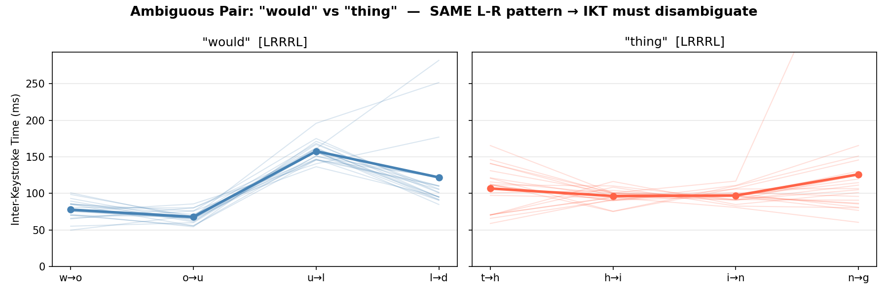

# Surface Typing Lab

A research toolkit for studying inter-keystroke timing (IKT) patterns,
built as a preliminary investigation into the methods of UniKey:
Enabling Surface-Based Typing with Commodity Smartwatches via Cross-Modal
Learning (Tan, Chan, Han — UIST 2025).
https://doi.org/10.1145/3746059.3747611

---

## Motivation

UniKey infers typed words from two coarse signals captured by a smartwatch:
which hand typed each key (L-R), and the time between consecutive keystrokes
(IKT). This project asks three concrete questions about that approach:

1. How ambiguous is L-R information alone across a real vocabulary?
2. Do IKT profiles actually differ between words that share the same L-R pattern?
3. Can a simple classifier learn to distinguish words from IKT + L-R features
   collected in a single session?

---

## Key Findings

### 1 — L-R alone is nearly useless

Across 1,240 words from the CEFR A1 vocabulary, 99.8% share their L-R hand
pattern with at least one other word of the same length. Only 61 unique
patterns exist for 1,240 words — an average of 20 words per pattern. The
largest group contains 54 words.

Words from the UniKey surface study illustrate the problem:

| Word   | L-R Pattern | Confused with N words |
|--------|-------------|----------------------|
| would  | [LRRRL]     | 46 others including could, thing, child, sound |
| there  | [LRLLL]     | 53 others including these, three, first, clear |
| home   | [RRRL]      | 32 others including know, mind, like, kind     |

This quantifies why IKT is not optional — it must do the disambiguation
that spatial information cannot.

### 2 — IKT profiles are distinct even when L-R is identical

"would" and "thing" share the same L-R pattern [LRRRL] and the same length.
A smartwatch cannot distinguish them from hand information alone. Yet their
IKT profiles are visually and quantitatively different:

"would" has a sharp spike at u->l (~155 ms) — a long same-hand reach from
right index to right ring finger. "thing" stays flat throughout (~95-105 ms).
This difference holds consistently across 20 repetitions, confirming the
paper's core hypothesis with personal typing data.

### 3 — The pipeline works from a single session

A small MLP trained on 20 repetitions per word (one 20-minute session)
achieves the following on a held-out test set with no augmentation:

| Metric          | This project | UniKey paper              |
|-----------------|--------------|---------------------------|
| Top-1 accuracy  | 70.8%        | ~70-75% (est. from WER)   |
| Top-5 accuracy  | 98.1%        | 93.55% (retry rate 6.45%) |
| Vocabulary size | 66 words     | 891 words                 |
| Training data   | 1 session    | Months, 10 participants   |

The top-5 result means the correct word appears in the top 5 predictions
in all but 5 out of 264 test cases — a retry rate of 1.9%. Direct
comparison with the paper's 6.45% should account for the smaller
vocabulary; harder vocabulary increases ambiguity.

---

## Components

### src/analysis/vocabulary_ambiguity.py

Computes L-R hand patterns for every word in the CEFR A1 vocabulary
using standard QWERTY finger assignments. Groups words by (pattern, length)
and reports ambiguity statistics. Includes a per-word spotlight query.

    PYTHONPATH=. python src/analysis/vocabulary_ambiguity.py

### src/collector/word_collector.py

Word-level IKT collector. Prompts the user to type each target word
N times, validates each attempt, and stores per-word IKT sequences as JSON.

    PYTHONPATH=. python -m src.collector.word_collector \
        --session session1 --reps 20

### src/analysis/visualize_ikts.py

Generates three figures: per-word IKT consistency across repetitions,
side-by-side comparison of ambiguous word pairs, and a vocabulary-wide
mean IKT summary colored by L-R pattern group.

    PYTHONPATH=. python src/analysis/visualize_ikts.py \
        --session data/raw/word_sessions/session_day1.json

### src/model/train.py

Trains a 4-layer MLP on IKT + L-R features following the architecture
in UniKey section 4.3.1. Applies Gaussian noise augmentation to the
training set only. Evaluates top-1 and top-5 accuracy on raw test samples.

    PYTHONPATH=. python src/model/train.py \
        --session data/raw/word_sessions/session_day1.json

---

## Setup

    git clone https://github.com/Baizho/surface-typing-lab.git
    cd surface-typing-lab
    python3 -m venv venv
    source venv/bin/activate
    pip install -r requirements.txt

---

## Session Data Format

Each collected session is stored as JSON:

    {
      "session_id": "day1",
      "reps_per_word": 20,
      "words": {
        "would": {
          "word": "would",
          "repetitions": [
            {
              "keys": ["w", "o", "u", "l", "d"],
              "key_times_ms": [0.0, 78.3, 143.1, 298.4, 421.2],
              "ikts": [78.3, 64.8, 155.3, 122.8]
            }
          ]
        }
      }
    }

---

## Limitations

- Vocabulary: 66 words vs the paper's 891. Accuracy would decrease with
  a larger vocabulary due to increased ambiguity.
- Single user: All data collected from one person. The paper generalised
  across 10 participants.
- No smartwatch: IKT collected from a physical keyboard, not surface
  tapping. Cross-modal transfer (keyboard to surface) is the paper's
  core contribution and is not replicated here.
- No language model: The paper re-ranks classifier output using GPT-2
  for contextual disambiguation. This pipeline stops at the classifier.

---

## Project Structure

    surface-typing-lab/
    +-- src/
    |   +-- analysis/
    |   |   +-- vocabulary_ambiguity.py
    |   |   +-- visualize_ikts.py
    |   +-- collector/
    |   |   +-- word_collector.py
    |   +-- data/
    |   |   +-- cefr_a1.py
    |   +-- model/
    |       +-- classifier.py
    |       +-- train.py
    +-- data/
    |   +-- raw/word_sessions/
    |   +-- figures/
    +-- models/
    +-- reports/
    +-- README.md

---

Built as preparatory research for investigating surface-based typing
inference and wearable sensing. Motivated by UniKey (UIST 2025) and
the open problems it identifies.
